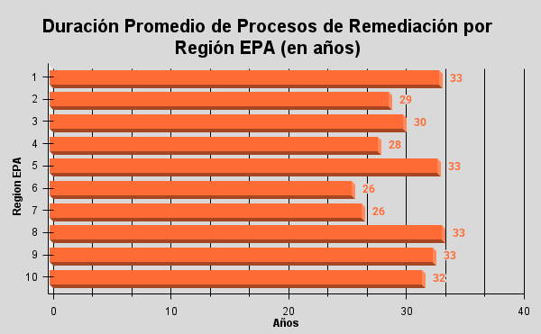
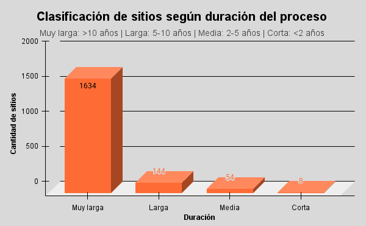

# Análisis de Remediación de Sitios Superfund (NPL – EPA, EE.UU.)

## Descripción del proyecto

Este proyecto analiza datos públicos del programa **Superfund** de la *Environmental Protection Agency (EPA)* de Estados Unidos, con foco en los sitios incluidos en la **National Priorities List (NPL)**, que representa el listado oficial de los sitios contaminados de mayor riesgo ambiental del país.

El objetivo del análisis es evaluar los **tiempos de permanencia y estado de remediación** de estos sitios, identificando patrones temporales, cuellos de botella y diferencias regionales, desde una perspectiva de **gestión ambiental y planificación**.

El proyecto está orientado a demostrar habilidades reales de **Data Analytics aplicado a problemáticas ambientales**, con énfasis en:
- limpieza y transformación de datos,
- construcción de KPIs,
- análisis exploratorio,
- visualización clara,
- documentación reproducible.

---

## Contexto: ¿Qué es la NPL?

La **National Priorities List (NPL)** es el listado oficial de la EPA que identifica los sitios contaminados considerados prioritarios a nivel nacional, los cuales requieren intervención federal bajo el programa **Superfund**.

La inclusión de un sitio en la NPL implica:
- alta complejidad ambiental,
- riesgos significativos para la salud o el ambiente,
- procesos de remediación prolongados y costosos.

El tiempo de permanencia de un sitio en la NPL es un buen **indicador proxy de la complejidad técnica y administrativa** del proceso de remediación.

---

## Conjunto de datos

- **Fuente:** Environmental Protection Agency (EPA)
- **Dataset:** *Superfund National Priorities List (NPL) – Sites with Status Information*
- **Formato:** CSV
- **Datos originales:** /datos/crudos/Superfund_NPL_Sitios_con_Estado.csv
- **Cobertura:** Sitios NPL a nivel nacional (EE.UU.)
- **Variables principales:**
  - Identificación del sitio
  - Estado administrativo en la NPL
  - Fechas de ingreso y salida
  - Ubicación (estado y región EPA)

El dataset original se conserva sin modificaciones para asegurar reproducibilidad.

---

## Herramientas utilizadas

- **Google Sheets**
  - Limpieza y transformación de datos
  - Cálculo de variables derivadas
  - Tablas dinámicas
  - Dashboard
- **GitHub**
  - Versionado
  - Documentación
  - Visualización del proyecto

---

## Metodología de análisis

1. **Separación de datos crudos y datos de trabajo**
   - Los datos originales no fueron alterados.
2. **Limpieza y normalización**
   - Corrección de formatos de fecha
   - Normalización de estados administrativos
3. **Creación de variables derivadas**
   - Tiempo de permanencia en la NPL (días y años)
   - Clasificación por duración
   - Identificación de sitios activos de larga duración (>10 años)
4. **Análisis exploratorio**
   - KPIs generales
   - Tablas dinámicas por estado y región
5. **Visualización**
   - Gráficos orientados a interpretación ejecutiva
   - Dashboard sintético

Para sitios activos, la duración se calcula hasta la fecha actual del análisis.

Los supuestos, decisiones metodológicas y limitaciones se documentan en /docs/metodologia.md.

---

## Principales indicadores (KPIs)

- **Total de sitios analizados**
- **Porcentaje de sitios remediados**
- **Cantidad de sitios activos**
- **Cantidad de sitios activos con más de 10 años en el programa**

Estos indicadores permiten evaluar la carga histórica y el estado actual del programa Superfund.

---

## Resultados y visualizaciones

### Distribución de sitios por estado de remediación

La mayoría de los sitios incluidos en la NPL **continúan activos**, lo que evidencia la naturaleza prolongada de los procesos de remediación y la acumulación histórica de casos.

---

### Duración promedio de los procesos por región EPA

Todas las regiones presentan **duraciones promedio elevadas (≈25–33 años)**, lo que sugiere que la complejidad del proceso es **estructural y sistémica**, más que un fenómeno localizado.

---

### Clasificación de sitios según duración del proceso

Predominan ampliamente los sitios con **duraciones mayores a 10 años**, confirmando que la NPL está compuesta por casos de muy largo plazo.

---

### Evolución temporal de ingresos a la NPL

Se observa una fuerte concentración de ingresos en los primeros años del programa, seguida por una estabilización, lo que refleja una **carga histórica heredada** que aún persiste.

---

### Estados con mayor cantidad de sitios activos >10 años (Top 10)

Algunos estados concentran una mayor cantidad de sitios activos de larga duración, lo que puede asociarse a factores históricos, industriales y regulatorios.

---

## Conclusiones

- La remediación de sitios Superfund es un proceso estructuralmente largo, con duraciones promedio superiores a varias décadas.
- La mayoría de los sitios de la NPL siguen activos décadas después de su ingreso.
- Existe una alta proporción de sitios activos, lo que representa una carga ambiental y administrativa sostenida.
- Las duraciones elevadas son consistentes entre regiones, indicando **desafíos estructurales**.
- Las diferencias regionales son moderadas, lo que indica que la complejidad del problema es sistémica.
- La identificación de sitios activos de larga duración permite focalizar análisis de gestión y planificación.
- Los resultados refuerzan la importancia de planificación a largo plazo, priorización de sitios críticos y seguimiento mediante indicadores claros.

---

## Limitaciones del análisis

- El dataset no incluye información técnica sobre métodos de remediación ni costos del proceso.
- El tiempo de permanencia en la NPL es una **aproximación de la duración del proceso**, no una medida exacta de intervención física.
- No se analizan variables socioeconómicas o presupuestarias.

 

